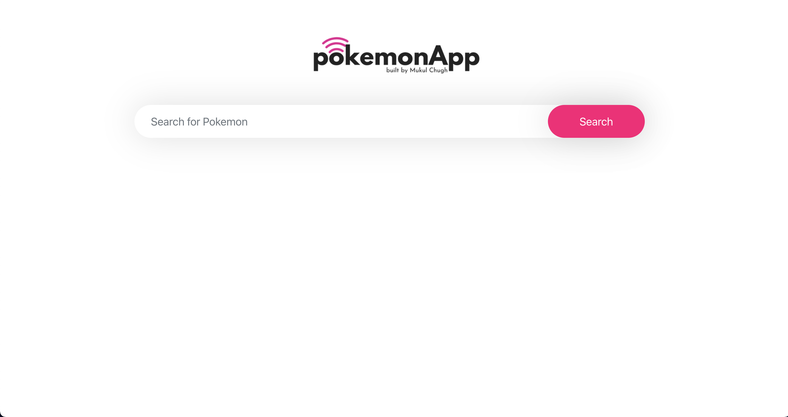
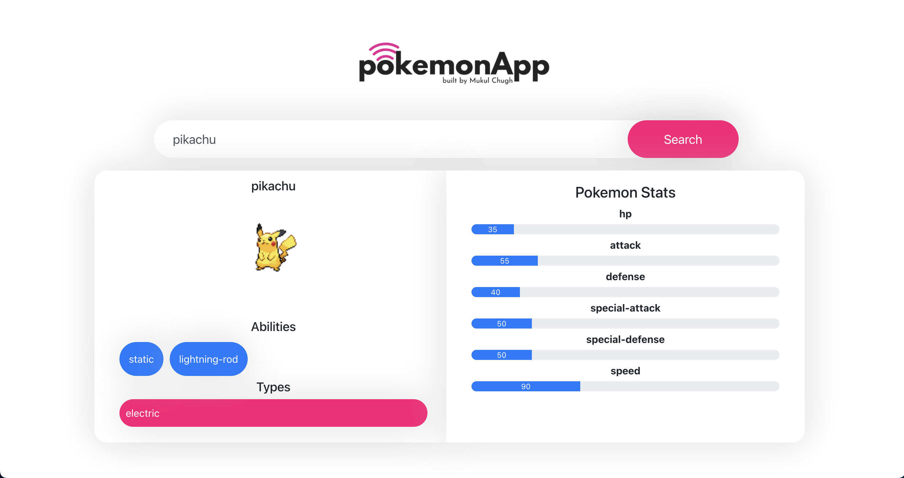

<div id="top"></div>
<!--
*** Thanks for checking out the POKEMON APP. If you have a suggestion
*** that would make this better, please fork the repo and create a pull request
*** or simply open an issue with the tag "enhancement".
*** Don't forget to give the project a star!
*** Thanks again! Now go create something AMAZING! :D
-->

<!-- PROJECT LOGO -->
<br />
<div align="center">
  <a href="https://github.com/mukulchugh/Pokemon-App-InstaHomes-Asssignment/">
    
  </a>

  <h3 align="center">Pokemon App</h3>

  <p align="center">
    A PokemonApp built as part of my assignment for Internship at InstaHomes!
    <br />
    <a href="https://pokemon-app-mukul.netlify.app/">View Demo</a>
    ·
    <a href="https://github.com/mukulchugh/Pokemon-App-InstaHomes-Asssignment/issues">Report Bug</a>
    ·
    <a href="https://github.com/mukulchugh/Pokemon-App-InstaHomes-Asssignment/issues">Request Feature</a>
  </p>
</div>


<!-- TABLE OF CONTENTS -->
<details>
  <summary>Table of Contents</summary>
  <ol>
    <li>
      <a href="#about-the-project">About The Project</a>
      <ul>
        <li><a href="#built-with">Built With</a></li>
      </ul>
    </li>
    <li>
      <a href="#getting-started">Getting Started</a>
      <ul>
        <li><a href="#prerequisites">Prerequisites</a></li>
        <li><a href="#installation">Installation</a></li>
      </ul>
    </li>
    <li><a href="#contact">Contact</a></li>
    <li><a href="#acknowledgments">Acknowledgments</a></li>
  </ol>
</details>


<!-- ABOUT THE PROJECT -->
## About The Project

  <a href="https://github.com/mukulchugh/Pokemon-App-InstaHomes-Asssignment/">
    
  </a>
    <a href="https://github.com/mukulchugh/Pokemon-App-InstaHomes-Asssignment/">
    
  </a>

This is a pokemon app which fetches Pokemon data from PokeAPI and displays the queries below the searchbar.

<p align="right">(<a href="#top">back to top</a>)</p>


### Built With

This section should list any major frameworks/libraries used to bootstrap your project. Leave any add-ons/plugins for the acknowledgements section. Here are a few examples.

* [React.js](https://reactjs.org/)
* [PokemonAPI](https://pokeapi.co/)

<p align="right">(<a href="#top">back to top</a>)</p>


<!-- GETTING STARTED -->
## Getting Started

This is an example of how you may give instructions on setting up your project locally.
To get a local copy up and running follow these simple example steps.

### Prerequisites

This is an example of how to list things you need to use the software and how to install them.
* npm
  ```sh
  npm install npm@latest -g
  ```

### Installation

1. Clone the repo
   ```sh
   git clone https://github.com/your_username_/Project-Name.git
   ```
2. Install NPM packages
   ```sh
   npm install
   ```
   or
   ```sh
   yarn install
   ```
   
3. Run the application
   ```sh
   npm start
   ```
   or
   ```sh
   yarn start
   ```

<p align="right">(<a href="#top">back to top</a>)</p>


<!-- CONTACT -->
## Contact

Name - [@themukulchugh](https://twitter.com/themukulchugh) - mukulchughofficial@gmail.com

Project Link: [https://github.com/mukulchugh/Pokemon-App-InstaHomes-Asssignment](https://github.com/mukulchugh/Pokemon-App-InstaHomes-Asssignment)

<p align="right">(<a href="#top">back to top</a>)</p>


<!-- ACKNOWLEDGMENTS -->
## Acknowledgments

Use this space to list resources you find helpful and would like to give credit to. I've included a few of my favorites to kick things off!

* [Netlify](https://netlify.com)
* [React Icons](https://react-icons.github.io/react-icons/search)

<p align="right">(<a href="#top">back to top</a>)</p>

